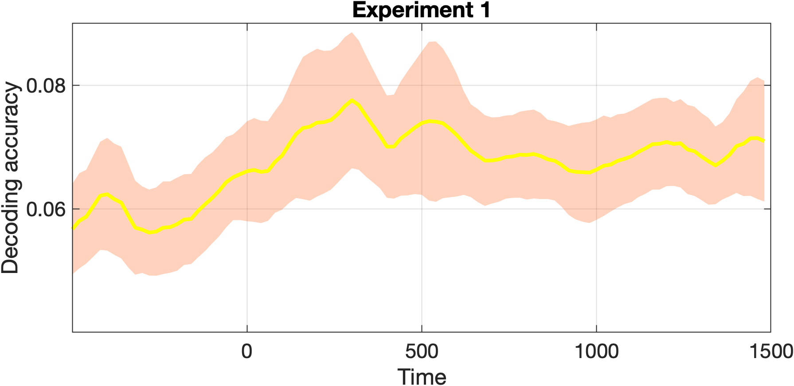
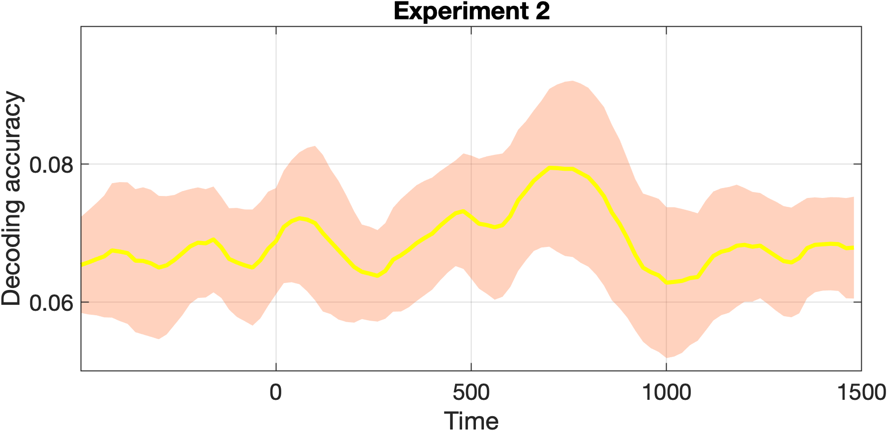

```{r setup, include=FALSE}
knitr::opts_chunk$set(echo = TRUE)
xfun::pkg_attach2("tidyverse",
"knitr",
"kableExtra",
"rmarkdown",
"bookdown",
"bib2df",
"magrittr")
```

\newpage 

# Introduction

This document contains the reanalysis  of the following paper:

Bae, G-Y., & Luck, S. J. (2019) Reactivation of previous experience in
a working memory task. *Psychological Science, 30*(4), 587-595.

@Bae performed their analysis in Matlab using EEGLab. Matlab was also used for the reanalysis.

The code for the reanalysis is available at
[https://github.com/ljcolling/odp-bae](https://github.com/ljcolling/odp-bae).
Due to the use of proprietary software, it is not possible to
automatically build this document. To manually build this document, clone
the git repository and run `make`. This makefile is currently only set up
to work with MATLAB R2021. To use with a different version of Matlab, edit
`./data/matlab` as appropriate before running `make`

The code in repository depends on `eeglab2021.1`. This is included in the
root of this repository.

```{r}

```


```{r}

```

# References
